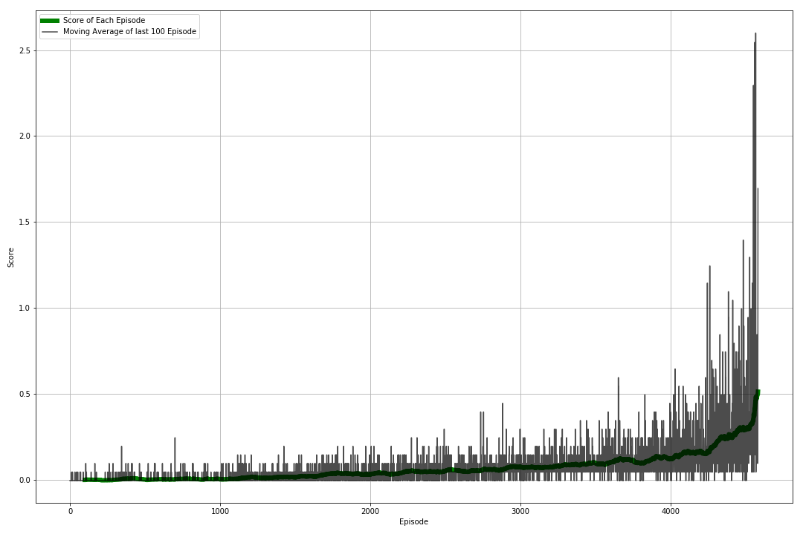

# Report

My agents succeded to meet the criteria around 6k episodes.

I have included a plot of one of the training


you can use the function to view the model
``` bash
python view.py
```

In this project, I used **PPO (Proximal Policy Optimization)**
algorithm, and for PPO, I developed **GAE (Generalized Advantage Estimation)**.

For policy, I picked **Actor/Critic framework**, where actor outputs the
probability of actions or draw actions from the disribution based on the current state,
and critic outputs the state value function. To reduce complexity,
actor and critic share hidden layers.

After fixed steps update of multi agent environment, actor and critic are
mini-batch updated by PPO/GAE.
I used my algorithm from the previous project even though there was a better
suited one DDPG.


**Why I choose the particular algorithm?**
I used it because it was a familiar algorithm. It was able to solve the problem
within the restrictions.

**Did you used replay buffer, epsilon-greedy, etc approaches? (Also are both agents sharing same experience buffer or different)**
My agents share the same buffer.

**Is the noise added to agents?**
For agents there is noise on action.

**Why you have chosen these particular hyperparameters (like you took from the paper, or result of your own experimentation)?**
The hyperparameters are chosen with some series of experimentation. However,
I believe it might not be the optimal solution.

**Why you chose the particular model architecture for Actor/Critic?**
I prefered simple to implement method.

Hidden layers for the model  

Actor model
```
Input: State(8)
Dense(512) LeakyReLU  
Dense(256) LeakyReLU  
Dense(2) tanh : Output of Actor  
```
 Critic model
```
Input: State(8)
Dense(512) LeakyReLU  
Dense(256) LeakyReLU  
Dense(1): Output of Critic
```

The output of actor model is used by mean parameter of normal distribution.
When agent plays in simulator, actor draws actions from distribution at random.
When agent updates model based on actions already drew from the model,
actor returns likelihood of actions of distribution.
(Variance parameters of normal distribution are also model parameters)

Because output of agents fluctuates based on normal distribution, agent can reach
optimal parameters in the balance between exploration and exploitation.

## Hyperparameters

- Discount factor gamma:  0.99
- GAE lambda: 0.96
- Before model update, advantage is normalized to standard normal distribution.
- PPO clipping parameter (eps): 0.1
- batch: 1024
- Actor/Critic are simultaneously updated using sum of loss of each model.
- Model is updated by mini-batch.
  - Optimizer: Adam
  - Learning rate:  1e-4
  - number of epoch is 20
  - mini batch size is 128

## Future Improvements

- **Needs improvement on the hyperparameters**
  The model is converging very slowly. There can be better parameters that
  should be explored.

- **Model should be changed with a better suited one**
  PPO/GAE algorithm was not very successful in this example. I want to
  try different approaches such as DDPG.

- With the help of my reviewer I noted following possible future updates:
- Use parameter space noise rather than noise on action. https://vimeo.com/252185862https://github.com/jvmancuso/ParamNoise
- We can use prioritised experience buffer. https://github.com/Damcy/prioritized-experience-replay
- Different replay buffer for actor/critic
- Try adding dropouts in critic network
- Turn off OU noise and use random noise
